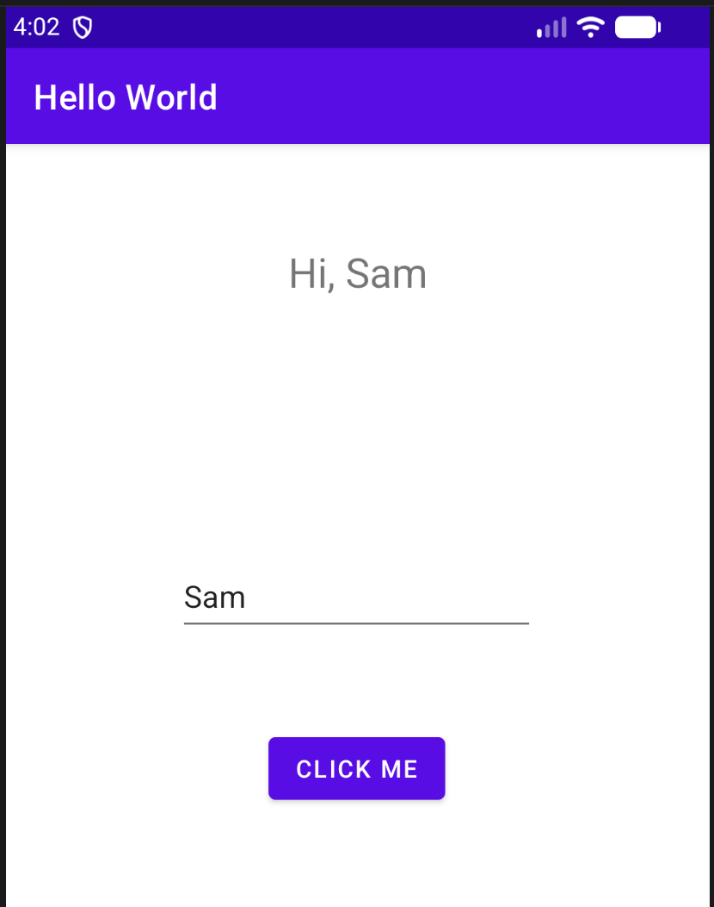

Read Me!

This app has a view to enter or edit text and a display view up top, which by default displays "Hello World."
There's also a button, when clicked, that updates the display view on top to whatever is typed in the edit text view, prefixed by Hi ...

